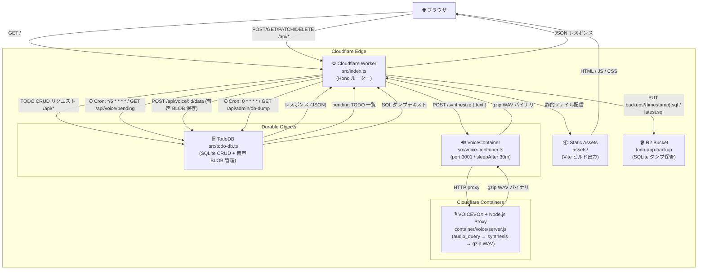

# アーキテクチャ

## システム構成図



## コンポーネント一覧

| コンポーネント | 技術 | 役割 |
|---|---|---|
| `src/index.ts` | Cloudflare Worker + Hono | ルーティング / Cron ハンドラ |
| `src/todo-db.ts` | Durable Object + SQLite | TODO CRUD + 音声 API + DB ダンプ |
| `src/voice-container.ts` | Cloudflare Containers | VOICEVOX DO クラス定義 |
| `container/voice/` | Docker (ubuntu:24.04 + VOICEVOX + Node.js) | 音声合成プロキシサーバー |
| `frontend/` | Vite + Alpine.js + Pico.css | フロントエンドソース |
| `assets/` | Cloudflare Static Assets | Vite ビルド出力 (配信用) |
| R2 `todo-app-backup` | Cloudflare R2 | SQLite ダンプのバックアップ保存先 |

## データフロー詳細

### TODO 作成 → 音声合成フロー

```
1. ブラウザ: POST /api/todos { "title": "..." }
2. Worker → TodoDB: INSERT INTO todos (voice_status = 'pending')
3. Cron (*/5): GET /api/voice/pending → pending TODO 一覧取得
4. VoiceContainer: POST /synthesize { text }
       → VOICEVOX audio_query + synthesis
       → gzip 圧縮 WAV バイナリ
5. PATCH /api/voice/:id/status { status: "processing" }
6. POST /api/voice/:id/data { audio: <ArrayBuffer> }
       → voice_data BLOB、voice_status = 'done' に更新
7. フロントエンド: 15 秒ごとにポーリング → 🔊 ボタン表示
```

### R2 バックアップフロー

```
1. Cron (0 * * * *): backupToR2(env) 呼び出し
2. GET /api/admin/db-dump → CREATE TABLE + INSERT 形式 SQL テキスト生成
3. R2 PUT backups/{timestamp}.sql  ← タイムスタンプ付き (蓄積)
4. R2 PUT backups/latest.sql       ← 常に最新で上書き
```

## プロジェクト構成

```
cloudflare-cf/
├── .vscode/
│   └── mcp.json                # Cloudflare MCP サーバー設定
├── assets/                     # Vite ビルド出力 (自動生成・Static Assets で配信)
├── container/
│   └── voice/
│       ├── Dockerfile          # ubuntu:24.04 + VOICEVOX v0.25.1 + Node.js 20
│       ├── start.sh            # VOICEVOX 起動待機 → Node プロキシ起動
│       ├── server.js           # HTTP プロキシ port 3001 (gzip 圧縮)
│       └── package.json
├── docs/
│   ├── architecture.md         # このファイル
│   ├── spec.md                 # 仕様書
│   └── usage.md                # 使い方
├── frontend/
│   ├── index.html              # Alpine.js ディレクティブ付き HTML
│   ├── main.ts                 # Alpine.js コンポーネント
│   └── style.css               # Pico.css violet + カスタムスタイル
├── src/
│   ├── index.ts                # Worker エントリーポイント + Cron ハンドラ
│   ├── todo-db.ts              # Durable Object (SQLite CRUD + 音声 API + DB ダンプ)
│   ├── voice-container.ts      # VoiceContainer クラス定義 (port 3001, sleepAfter 30m)
│   └── container.ts            # TodoContainer (旧クラス・後方互換用エクスポート)
├── wrangler.jsonc
├── package.json
├── tsconfig.json
└── vite.config.ts
```
