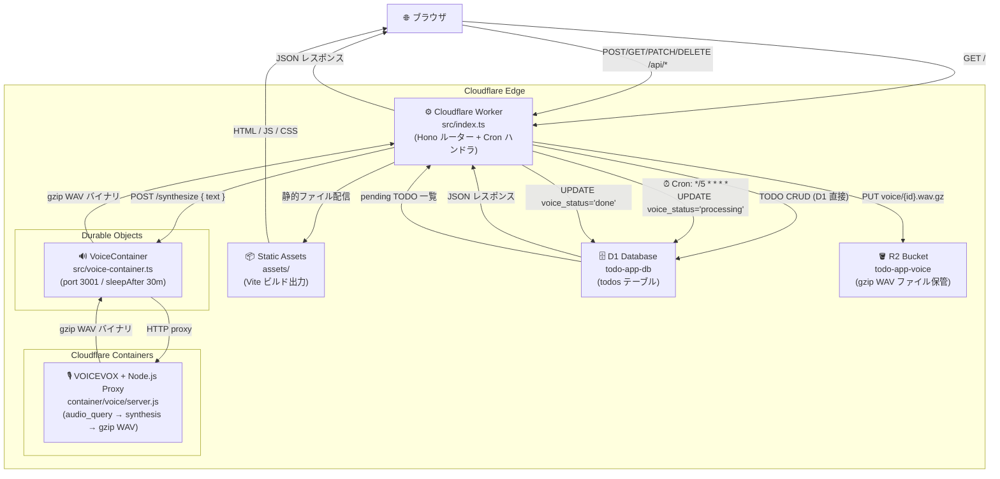

# アーキテクチャ

## システム構成図



## コンポーネント一覧

| コンポーネント | 技術 | 役割 |
|---|---|---|
| `src/index.ts` | Cloudflare Worker + Hono | エントリーポイント / Cron ハンドラ |
| `src/todo-service.ts` | Hono Router | TODO CRUD ルート + `runVoiceSynthesis` 関数 |
| `src/voice-container.ts` | Cloudflare Containers | VoiceContainer DO クラス定義 |
| `src/container.ts` | Durable Object | TodoContainer (後方互換エクスポート用) |
| `container/voice/` | Docker (ubuntu:24.04 + VOICEVOX + Node.js) | 音声合成プロキシサーバー |
| `frontend/` | Vite + Alpine.js + Pico.css | フロントエンドソース |
| `assets/` | Cloudflare Static Assets | Vite ビルド出力 (配信用) |
| D1 `todo-app-db` | Cloudflare D1 | TODO データ永続化 |
| R2 `todo-app-voice` | Cloudflare R2 | gzip 圧縮 WAV ファイル保管 |

## データフロー詳細

### TODO 作成 → 音声合成フロー

```
1. ブラウザ: POST /api/todos { "title": "..." }
2. Worker → D1: INSERT INTO todos (voice_status = 'pending')
3. Cron (*/5): UPDATE todos SET voice_status='processing'
               WHERE id IN (SELECT id FROM todos WHERE voice_status='pending')
               RETURNING id, title
4. VoiceContainer: POST /synthesize { text }
       → VOICEVOX audio_query + synthesis
       → gzip 圧縮 WAV バイナリ
5. R2: PUT voice/{id}.wav.gz
6. D1: UPDATE todos SET voice_r2_key=?, voice_status='done' WHERE id=?
7. フロントエンド: 15 秒ごとにポーリング → 🔊 ボタン表示
```

## プロジェクト構成

```
cloudflare-cf/
├── .vscode/
│   └── mcp.json                # Cloudflare MCP サーバー設定
├── assets/                     # Vite ビルド出力 (自動生成・Static Assets で配信)
├── container/
│   └── voice/
│       ├── Dockerfile          # ubuntu:24.04 + VOICEVOX v0.25.1 + Node.js 20
│       ├── start.sh            # VOICEVOX 起動待機 → Node プロキシ起動
│       ├── server.js           # HTTP プロキシ port 3001 (gzip 圧縮)
│       └── package.json
├── docs/
│   ├── architecture.md         # このファイル
│   ├── spec.md                 # 仕様書
│   └── usage.md                # 使い方
├── frontend/
│   ├── index.html              # Alpine.js ディレクティブ付き HTML
│   ├── main.ts                 # Alpine.js コンポーネント
│   └── style.css               # Pico.css violet + カスタムスタイル
├── migrations/
│   └── 0001_init.sql           # D1 スキーマ (todos テーブル)
├── scripts/
│   ├── restore-local.mjs       # 本番 D1 → ローカル D1 データ復元
│   └── voice-batch-local.mjs   # ローカル Docker で音声合成バッチ実行
├── src/
│   ├── index.ts                # Worker エントリーポイント + Cron ハンドラ
│   ├── todo-service.ts         # TODO CRUD ルーター + runVoiceSynthesis 関数
│   ├── voice-container.ts      # VoiceContainer クラス定義 (port 3001, sleepAfter 30m)
│   └── container.ts            # TodoContainer (後方互換エクスポート)
├── wrangler.jsonc
├── package.json
├── tsconfig.json
└── vite.config.ts
```
